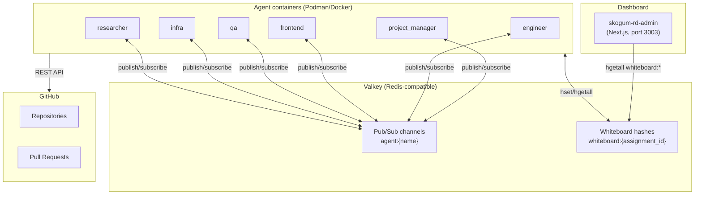
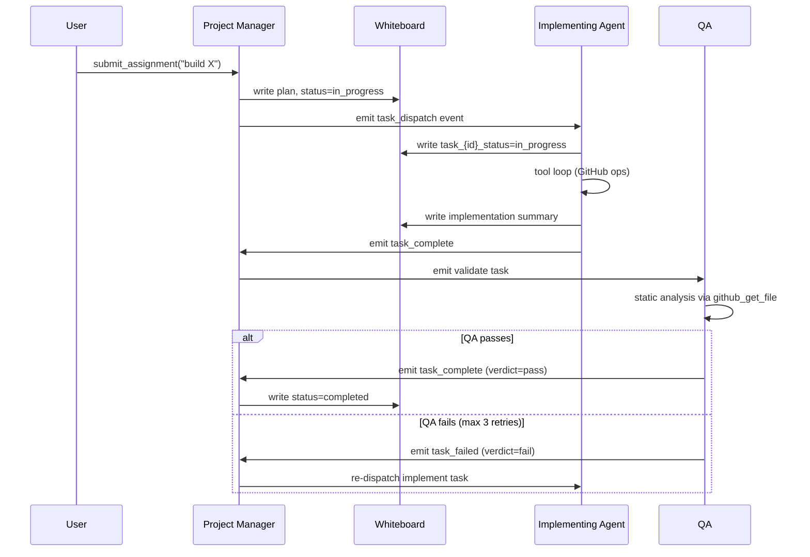

# Architecture Overview

## System components



## Technology stack

| Layer | Technology | Notes |
|---|---|---|
| Agent runtime | Python 3.12, asyncio | All agents share `BaseAgent` |
| LLM | Mistral AI (devstral-latest) | Function calling / tool loop |
| Event bus | Valkey pub/sub | One channel per agent: `agent:{name}` |
| Shared state | Valkey hashes | One hash per assignment: `whiteboard:{id}` |
| GitHub integration | GitHub REST API via httpx | 9 tools: repos, files, PRs, secrets, issues |
| Dashboard | Next.js 16.2, Tailwind CSS, Framer Motion | Reads Valkey directly via ioredis |
| Container runtime | Podman / Docker | docker-compose.yml + k8s manifests |

## Assignment lifecycle



## Dependency graph execution

The PM resolves task dependencies before dispatching. Tasks with no unmet dependencies are dispatched immediately and in parallel; dependent tasks wait for their `depends_on` tasks to complete.

```json
{
  "tasks": [
    { "id": "create_repo",   "depends_on": [] },
    { "id": "setup_project", "depends_on": ["create_repo"] },
    { "id": "implement_api", "depends_on": ["setup_project"] },
    { "id": "validate",      "depends_on": ["implement_api"] }
  ]
}
```
