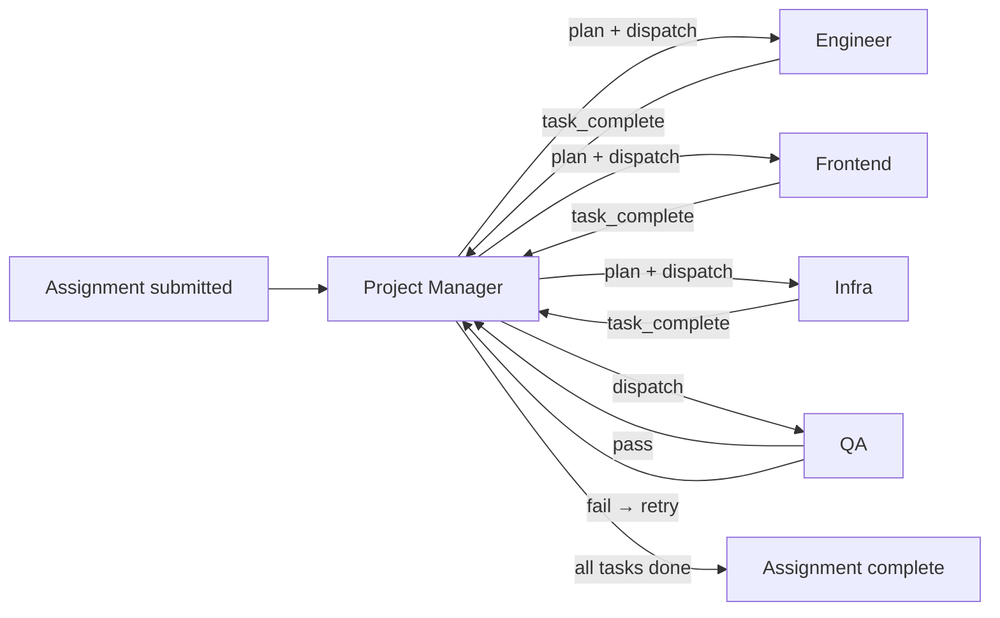

# Skogum R&D — Multi-Agent System

Skogum's multi-agent platform executes software engineering assignments end-to-end using a team of specialized AI agents. You describe a task in plain language; the system plans, implements, validates, and ships it.

## How it works

## Key concepts

| Concept | Description |
|---|---|
| **Whiteboard** | Shared Valkey hash per assignment — agents read and write state here |
| **Event bus** | Valkey pub/sub channels — agents communicate by emitting events |
| **Task plan** | JSON produced by PM — list of tasks with types, agents, and dependencies |
| **Tool loop** | Agents call Mistral with tools; the model invokes tools until it has enough to produce a result |

## Quick links

- [Architecture overview](architecture.md)
- [Agent reference](agents/index.md)
- [Operations guide](operations.md)
- [Admin dashboard](dashboard.md)
