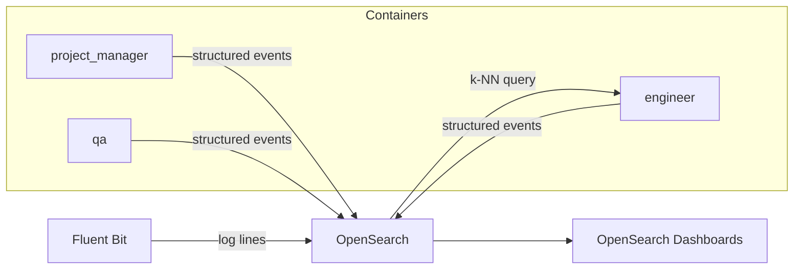

# OpenSearch Integration

## Overview

OpenSearch is an open-source search and analytics engine (fork of Elasticsearch). In the context of the Skogum agent platform it addresses three distinct problems: log correlation across agents, analytics over assignment outcomes, and semantic vector search as a memory backend.

## Use cases

### 1. Cross-agent log search

**Current pain:** debugging requires tailing each container separately (`podman logs <agent>`). Events from PM, engineer, and QA for the same assignment are interleaved across three separate log streams with no way to query them together.

**With OpenSearch:** Fluent Bit ships all container logs to OpenSearch, tagged with `assignment_id` and `agent`. A single query returns the full chronological event stream for any assignment across all agents:

```
assignment_id: "98efb233" AND level: ERROR
```

This is the single highest-value use case at current scale.

### 2. QA failure analytics

Every QA verdict is stored on the whiteboard but only as the latest state — history is lost when a new verdict overwrites it. Indexing every verdict as an immutable OpenSearch document enables:

- *"What are the 10 most common QA failure reasons this month?"*
- *"Which agent produces the most retries?"*
- *"Which task types have the highest failure rate?"*

This turns repeated manual debugging into actionable patterns that feed back into prompt and plan improvements.

### 3. Assignment audit trail

The whiteboard is mutable — you can't see how state evolved. Indexing every whiteboard write as an event gives a full immutable history per assignment, useful when a final state doesn't explain what went wrong mid-flight.

### 4. Semantic memory (vector search)

OpenSearch's k-NN plugin supports approximate nearest-neighbour search over dense vectors. This enables semantic retrieval for agent memory:

- Agent embeds the current task description
- Queries OpenSearch for the top-k most relevant past experiences
- Injects retrieved context into the Mistral prompt

This is more powerful than exact key lookups in Valkey for open-ended questions like *"what do we know about Next.js projects in this org?"*

## Architecture



**Fluent Bit** handles log shipping — reads container stdout/stderr, enriches with container metadata, ships to OpenSearch. No agent code changes needed for log aggregation.

**Structured event indexing** requires a small addition to `BaseAgent.emit_event()` to also write a document to OpenSearch alongside the Valkey pub/sub event.

## Relation to Valkey

OpenSearch does not replace Valkey. The division of responsibility:

| Valkey | OpenSearch |
|---|---|
| Operational coordination (pub/sub) | Log aggregation and search |
| Whiteboard (live assignment state) | Immutable event history |
| Fast structured memory lookups | Semantic / vector memory |
| Sub-millisecond agent reads | Analytics and dashboards |

## Infrastructure cost

OpenSearch requires a minimum of ~2 GB RAM for a development instance. The natural `docker-compose.yml` addition:

```yaml
opensearch:
  image: opensearchproject/opensearch:2
  environment:
    - discovery.type=single-node
    - DISABLE_SECURITY_PLUGIN=true
    - OPENSEARCH_JAVA_OPTS=-Xms1g -Xmx1g
  volumes:
    - opensearch-data:/usr/share/opensearch/data
  ports:
    - "9200:9200"

opensearch-dashboards:
  image: opensearchproject/opensearch-dashboards:2
  environment:
    - OPENSEARCH_HOSTS=http://opensearch:9200
    - DISABLE_SECURITY_DASHBOARDS_PLUGIN=true
  ports:
    - "5601:5601"

fluent-bit:
  image: fluent/fluent-bit:3
  volumes:
    - /var/lib/containers:/var/lib/containers:ro
    - ./fluent-bit.conf:/fluent-bit/etc/fluent-bit.conf:ro
```

At current assignment volume (a few per day), the log search use case alone justifies the overhead. The analytics and vector memory use cases become the primary justification as volume grows.
