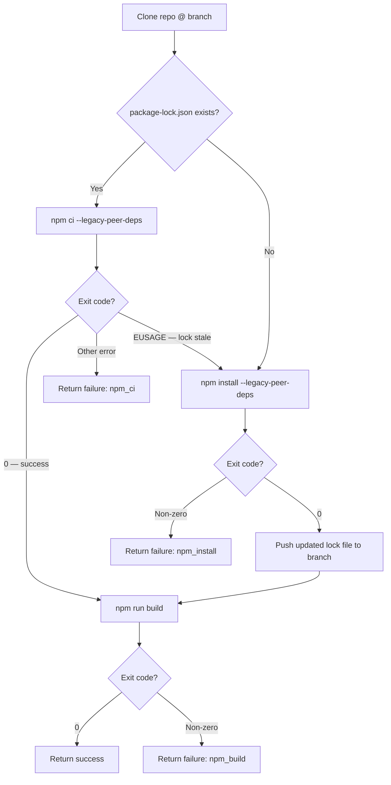

# Build & Test Tool

`build_and_test` clones a repo, installs dependencies, runs the build, and pushes a `package-lock.json` back to the branch if one was missing or stale.

## Signature

```python
build_and_test(repo, branch="main", org=None) -> dict
```

## What it does



## Lock file handling

The tool handles three lock file states:

| State | Action |
|---|---|
| No `package-lock.json` | Run `npm install`, push generated lock file |
| Valid lock file | Run `npm ci` (faster, reproducible) |
| Stale lock file (EUSAGE) | Fall back to `npm install`, push updated lock file |

The stale lock case arises when `package.json` is updated (new dependencies added) but the lock file isn't regenerated. `npm ci` exits with `EUSAGE` in this case, which the tool detects and recovers from automatically.

## Return value

```python
# Success
{"success": True, "build_output": "..."}

# Failure
{"success": False, "step": "npm_ci" | "npm_install" | "npm_build", "output": "..."}
```

## Notes

- Runs in a temporary directory; cleans up after itself
- Uses `asyncio.to_thread` (subprocess calls are blocking)
- `--legacy-peer-deps` is passed to npm to handle peer dependency conflicts common in Next.js projects
