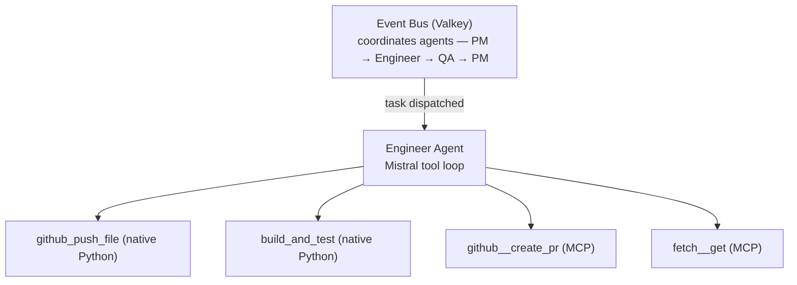

# MCP Server Consumption

Agents can connect to any [Model Context Protocol](https://modelcontextprotocol.io) server and use its tools inside the Mistral tool loop, alongside existing native Python tools.

## How it fits the architecture

MCP and the Valkey event bus operate at different layers and do not interfere with each other.



**Event bus** — handles agent-to-agent coordination: who does what, ordering, retries, whiteboard state. Unchanged by MCP.

**MCP** — extends what a single agent can *do* while executing a task. Once the agent picks up an event from the queue, MCP provides additional tools for the Mistral loop. The agent still emits `task_complete` or `task_failed` to the PM exactly as before.

## Connecting an MCP server

Override `startup()` in any agent. It is called once before the event loop starts, so all tools are available for every task the agent handles.

```python
class ResearcherAgent(BaseAgent):
    async def startup(self):
        await self.connect_mcp_server(
            command="uvx",
            args=["mcp-server-fetch"],
            prefix="fetch",          # tools become: fetch__fetch
        )
        await self.connect_mcp_server(
            command="npx",
            args=["-y", "@modelcontextprotocol/server-github"],
            env={"GITHUB_TOKEN": os.getenv("GITHUB_TOKEN", "")},
            prefix="github",         # tools become: github__create_issue, etc.
        )
```

Multiple servers can be connected simultaneously. The `prefix` keeps tool names unique when two servers expose tools with the same name.

## `connect_mcp_server` reference

```python
await self.connect_mcp_server(
    command: str,               # executable: "npx", "uvx", "python", ...
    args: list[str],            # arguments to the executable
    env: dict[str, str] | None, # extra env vars merged with os.environ
    prefix: str = "",           # prepended as "{prefix}__{tool_name}"
)
```

What it does internally:

1. Spawns the server process via stdio transport
2. Runs the MCP initialisation handshake
3. Calls `tools/list` to fetch the server's tool catalogue
4. Translates each MCP JSON Schema → Mistral `Function` object
5. Registers each tool via `register_tool()` — available to the Mistral loop immediately
6. Stores the `AsyncExitStack` so the connection stays alive until `run()` exits

If the `mcp` package is not installed the method logs a warning and returns without crashing.

## Tool name conventions

| MCP server | prefix | Example tool name |
|---|---|---|
| `@modelcontextprotocol/server-github` | `github` | `github__create_issue` |
| `mcp-server-fetch` | `fetch` | `fetch__fetch` |
| `@modelcontextprotocol/server-filesystem` | `fs` | `fs__read_file` |
| `@modelcontextprotocol/server-postgres` | `pg` | `pg__query` |
| Custom internal server | `valkey` | `valkey__read_whiteboard` |

## Lifecycle and failure behaviour

MCP sessions are persistent for the agent's lifetime. Key behaviours:

| Scenario | What happens |
|---|---|
| Agent container restarts | `startup()` reconnects all MCP servers automatically |
| MCP server process crashes | Tool calls return an error; Mistral can reason about it and continue |
| MCP tool call hangs | Caught by the 10-minute `asyncio.wait_for` task timeout → `task_failed` emitted to PM |
| `mcp` package missing | Warning logged, agent starts without those tools |

## Writing a custom MCP server

Any Python script that implements the MCP stdio transport can be connected. Use the official `mcp` SDK:

```python
# mcp_servers/whiteboard_server.py
from mcp.server import Server
from mcp.server.stdio import stdio_server
from mcp import Tool
import json, os
import valkey

app = Server("whiteboard")

@app.tool()
async def read_whiteboard(assignment_id: str) -> str:
    """Read all fields from whiteboard:{assignment_id}."""
    r = valkey.from_url(os.environ["VALKEY_URL"])
    return json.dumps(r.hgetall(f"whiteboard:{assignment_id}"))

@app.tool()
async def write_whiteboard(assignment_id: str, key: str, value: str) -> str:
    """Set a field on whiteboard:{assignment_id}."""
    r = valkey.from_url(os.environ["VALKEY_URL"])
    r.hset(f"whiteboard:{assignment_id}", key, value)
    return "ok"

if __name__ == "__main__":
    import asyncio
    asyncio.run(stdio_server(app))
```

Connect it from an agent:

```python
async def startup(self):
    await self.connect_mcp_server(
        command="python",
        args=["/app/mcp_servers/whiteboard_server.py"],
        env={"VALKEY_URL": os.getenv("VALKEY_URL", "valkey://localhost:6379")},
        prefix="wb",
    )
```

## Suggested MCP servers per agent role

| Agent | Recommended MCP servers |
|---|---|
| **Researcher** | `mcp-server-fetch` (HTTP), `@modelcontextprotocol/server-github` (read repos) |
| **Engineer** | `@modelcontextprotocol/server-filesystem` (local files), `@modelcontextprotocol/server-postgres` |
| **Frontend** | `@modelcontextprotocol/server-github` (richer file ops) |
| **QA** | `@modelcontextprotocol/server-github` (file reads, issue creation) |
| **Infra** | Custom Kubernetes/cloud MCP server |
| **PM** | Custom MCP server exposing whiteboard + assignment submission |

## Installation

The `mcp` package is listed in `requirements.txt` and is available in all agent containers:

```
mcp>=1.0.0
```

MCP servers themselves are run as separate processes — they do not need to be installed in the agent image unless they are Python-based. Node-based servers (`npx -y ...`) require Node.js in the container; add it to the relevant Dockerfile if needed.
